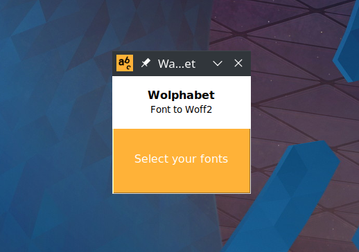
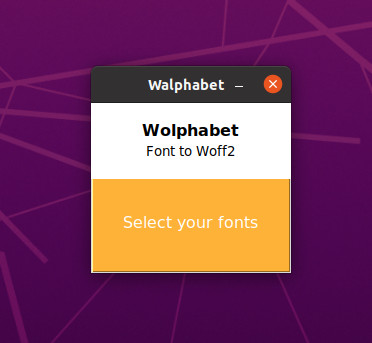

# Walphabet


Transform your fonts from TTF or OTF to WOFF2 in Windows and Linux.

## Windows

<p align="center">
  
</p>

## Linux: KDE

<p align="center">
  
</p>

## Linux: Gnome

<p align="center">
  
</p>

# Download

Linux -> https://github.com/tanrax/walphabet/releases/download/v1.0/Walphabet

Windows -> https://github.com/tanrax/walphabet/releases/download/v1.0/Walphabet.exe

(**Attention!** Windows Defender detects it as a virus because the executable is not signed by them, and I'm not willing to pay 60 euros per year. You have 2 options: add walphabet as an exception or clone the repository and compile your own binary.)

MacOS -> I need a volunteer with MacOS to create the binary.

# Development

## 0. Install Python dev

### Linux

```bash
sudo apt install python3-tk python3-dev
```

## 1. Install requirements

```
python3 -m venv venv
source venv/bin/activate
pip3 install -r requirements.txt
```

## 2. Build

### Linux

```bash
pyinstaller main.spec
```

### Windows

```bash
venv\Scripts\pyinstaller.exe main.spec
```

### MacOS

Install `python-tk`.

```bash
brew install python-tk
```

Next.

```bash
pyinstaller main.spec
```

## 3. Run

```bash
./dist/walphabet
```

## GUI

```bash
pip3 install pygubu-designer
```

and then run `pygubu-designer`.
